## Aim

Convert the molecular species phylogeny into an ultrametric time-calibrated species tree and use this for gene-tree-species-tree reconciliation.

## Learning outcomes

* What is the difference between a molecular and a time-calibrated phylogeny?
* What are gene-tree-species-tree reconciliation algorithms trying to achieve and how?

## Building an ultrametric time-calibrated species tree

{ style="float: right;" width=250}  <!-- AT. Double-check path -->

There are several tools available for converting molecular phylogenies to ultrametric time-calibrated trees. They usually require as input your molecular phylogeny as well as calibration points (estimates usually from fossils about the ranges of likely divergence times) for one or more nodes on the tree. We will use the **chronos** function of the [ape](http://ape-package.ird.fr/) package in R.

Before we download any genomics data, Let's create a working directory for this exercise, starting by opening a terminal on the Workspace if you've not already got one open. Then, from the `/workspace/biodivinfo/` directory, create a new directory (`mkdir`) and navigate into the new directory (`cd`):

```
cd /workspace/biodivinfo/
mkdir Session3
cd Session3/
```

Using the same set of 15 beetle species, but now applying the concatenation approach to be able to use alignments from 1'000 single-copy orthologous groups:

* Aligned each orthogroup
* Filtered/trimmed each orthogroup
* Concatenated the trimmed alignments into a superalignment
* Used RAxML to compute, with bootstraps, the molecular species phylogeny

This took several hours to run, therefore we are not going to try this in the class. Instead, the results are provided for you [here](https://gitlab.com/evogenlab/teaching-repos/biodivinfo/-/blob/main/data/Session3/OGs-1000-moltree-names-rooted.tre) and also pasted below, where the tree has been rooted based on the known outgroup species (`7054_0` & `224129_0`) and where internal labels and species names have been added to make it easier to interpret and compare with the current understanding of beetle phylogeny.

Here is the molecular species tree in Newick format:
```
((((((((50390_0_Diabrotica_virgifera:0.15666,7539_0_Leptinotarsa_decemlineata:0.15804)100:0.05974,217634_0_Anoplophora_glabripennis:0.11339)Chrysomeloidea[100]:0.04091,(7048_0_Sitophilus_oryzae:0.12494,77166_0_Dendroctonus_ponderosae:0.13601)Curculionoidea[100]:0.13858)100:0.02727,116153_0_Aethina_tumida:0.24260)100:0.03487,(115357_0_Harmonia_axyridis:0.06618,41139_0_Coccinella_septempunctata:0.07128)Coccinelloidea[100]:0.17882)88:0.01976,(41895_0_Tribolium_madens:0.02321,7070_0_Tribolium_castaneum:0.02060)Tenebrionoidea[100]:0.28640)100:0.09637,(110193_0_Nicrophorus_vespilloides:0.33251,(1629725_0_Oryctes_borbonicus:0.22252,166361_0_Onthophagus_taurus:0.24064)Scarabaeoidea[100]:0.07437)100:0.05341):0.00483,(224129_0_Agrilus_planipennis:0.31846,7054_0_Photinus_pyralis:0.29250):0.09174)100;
```
!!! note "Newick format - [Wikipedia](https://en.wikipedia.org/wiki/Newick_format)"
    * Parentheses indicate hierarchical relationships amongst species
    * Branches can be labelled with bootstrap values, _e.g._ 100
    * Branches can also be labelled with names, _e.g._ _Tenebrionoidea_
    * Notice the semicolon at the end of the tree - it is often forgotten but most tools won't recognize a file as Newick format if it's missing!

You can also copy the file from the provided data folder:
```
cp /workspace/biodivinfo/data/Session3/Step1/OGs-1000-moltree-names-rooted.tre .
```

Now to visualise the tree we will, as before, copy and paste this molecular species phylogeny to upload it to [iTOL](https://itol.embl.de/).

<figure>
  
</figure>

Use the iTOL `Control Panel (Advanced)` to turn on `Display` of `Node IDs` and turn on `Display` as `Text` the `Bootstraps`.

<figure>
  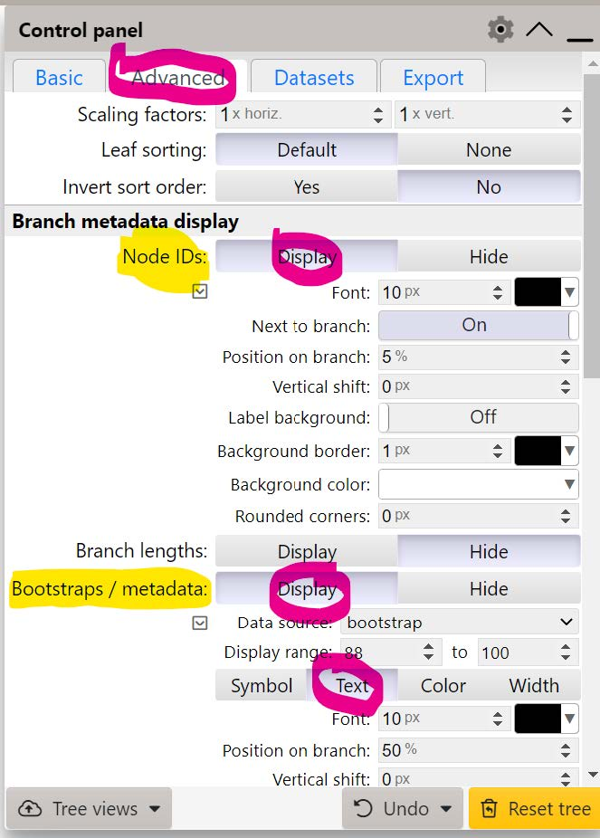
</figure>

Notice that now there is only one node that did not converge to 100% bootstrap support - regarding the placement of the groups of **_Tenebrionoidea_** & **_Coccinelloidea_**.

<figure>
  
</figure>

!!! note "If you did not manage to visualise the tree"
    You can find it on Gitpod at `/workspace/biodivinfo/data/Session3/Step1/tree_1000_OGs.jpg`. Or you can directly see it [here](https://gitlab.com/evogenlab/teaching-repos/biodivinfo/-/blob/main/data/Session3/Step1/tree_1000_OGs.jpg).

We now need to compare our tree to the literature to see if it is in agreement with the current thinking regarding the relations amongst beetle lineages.

**For comparison with the latest beetle phylogeny from the literature (see below):**

<figure>
  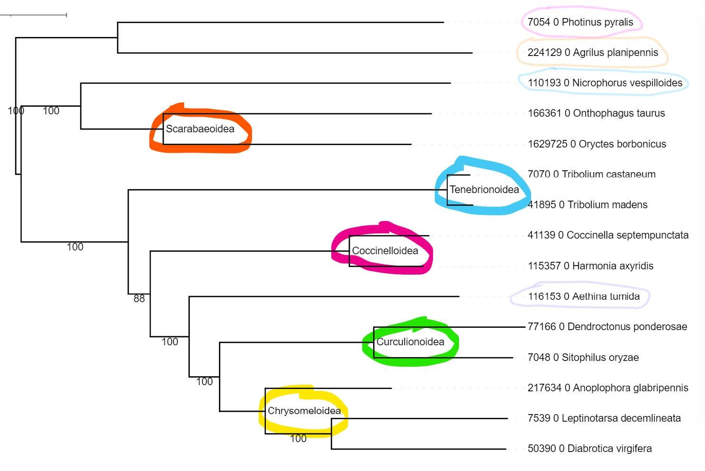
</figure>

You should be able to find the internal node labels, provided for you on the tree you have just uploaded on iToL:

<figure>
  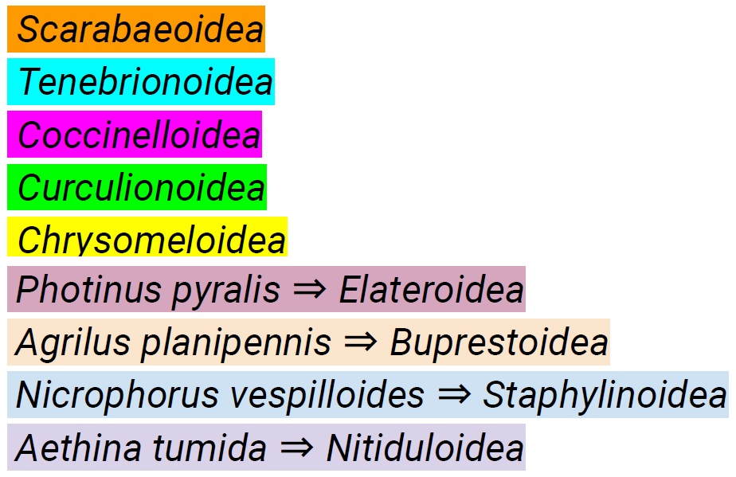
</figure>

**Question: Does our 1'000-orthogroup molecular species phylogeny agree with the current understanding of species relationships (see phylogeny below)?**

??? done "Answer"
    Yes! Remember you can invert two branches of a node to facilitate the comparison between the two trees!

<figure>
  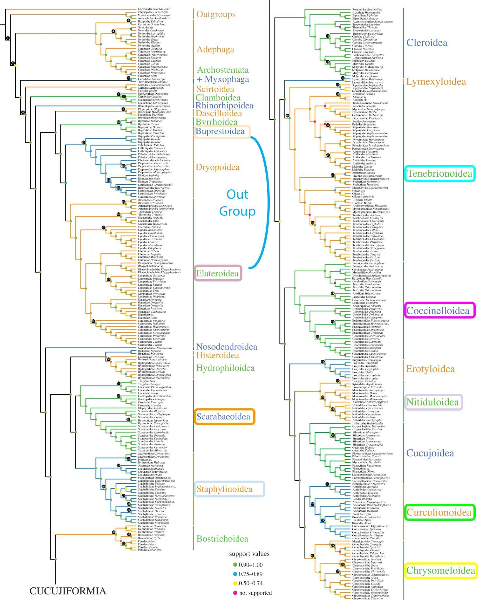
  <figcaption>Recent reference on Coleoptera phylogeny: Integrated phylogenomics and fossil data illuminate the evolution of beetles, Cai et al. 2022 </figcaption>
</figure>

!!! note
	Link to [Cai et al. 2022](https://doi.org/10.1098/rsos.211771).

We can now convert our molecular phylogeny to an ultrametric time-calibrated tree using the `chronos` function of the `ape` package.

!!! note "[Chronos](https://rdrr.io/cran/ape/man/chronos.html): Molecular Dating by Penalised Likelihood and Maximum Likelihood"
    * `chronos` is the main function fitting a chronogram to a phylogenetic tree whose branch lengths are in number of substitution per sites
    * `makeChronosCalib` is a tool to prepare data frames with the calibration points of the phylogenetic tree

We could provide multiple calibration points to smooth the tree, but for today we will just find an estimate for the root age and use that as the only calibration point. We can use [TimeTree.org](http://www.timetree.org/) to find a divergence estimate for any two beetle species in our collection that span the root of our tree, _e.g._ the age of the last common ancestor of _Agrilus planipennis_ and _Leptinotarsa decemlineata_.

<figure>
  
</figure>

TimeTree provides us with an "Adjusted Time" for the pairwise divergence time for _Agrilus Planipennis_ and _Leptinotarsa Decemlineata_ of 256 Million Years Ago (MYA).

<figure>
  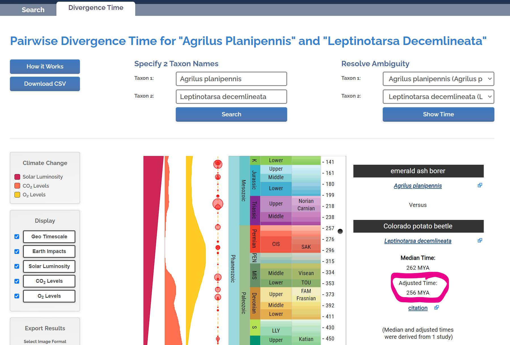
</figure>

<br>The R code for running chronos is provided here:
```R
# Converting a molecular species phylogeny into a time-calibrated species tree
# If you do not have 'ape' you will need to install it: install.packages("ape")

# Load ape package
library(ape)

# Read in the molecular phylogeny
# Make sure you are working in the same directory as the tree file
moltree<-read.tree("OGs-1000-moltree-names-rooted.tre")

# Provide root calibration age of 256 million years
calib<-makeChronosCalib(moltree, node="root", age.min=256)

# use the chronos function to convert the tree with the age constraint
timtree<-chronos(moltree, calibration=calib, lambda=1, model="discrete", control=chronos.control(nb.rate.cat=1))

# check that the result is indeed ultrametric
is.ultrametric(timtree)
write.tree(timtree, file="Coleoptera_TimeTree.tre")

```

Or you can fetch the R script with:
```
cp /workspace/biodivinfo/scripts/MolecularTree_to_TimeTree.R .
```

=== "If you want to run the script automatically"
    ```
    Rscript MolecularTree_to_TimeTree.R
    ```
=== "If you want to run the successive steps manually"
    * Launch R: `R`
    * Now for actually running chronos… first you need to load the library `ape`: `library("ape")`
    * Then you can copy the R code provided above or from the provided R script file (`MolecularTree_to_TimeTree.R`) and enter return to execute the code
        * `read.tree`: read in your molecular phylogeny file
        * `makeChronosCalib`: set the minimum age of the root of your tree
        * `chronos`: smooth conversion of the 'moltree' to the 'timetree'
        * `write.tree`: write the resulting timetree to a file (`Coleoptera_TimeTree.tre`)
    * To exit R simply type `q()` and then return
    * No need to save your workspace image: `Save workspace image? [y/n/c]: n`

<figure>
  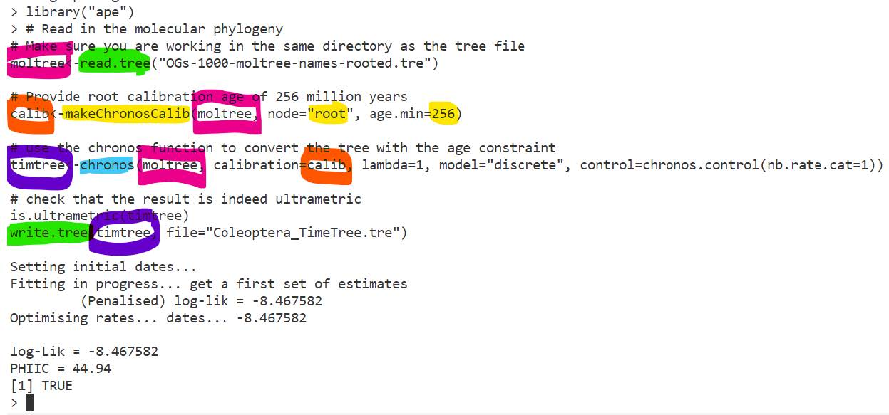
</figure>

Now Let's open the tree file produced by chronos (`Coleoptera_TimeTree.tre`) and use [iTOL](https://itol.embl.de/) to view it (as before), you can find the file in the EXPLORER menu under Session3, copy the Newick formatted tree and go to [iTOL](https://itol.embl.de/) to upload it.

<figure>
  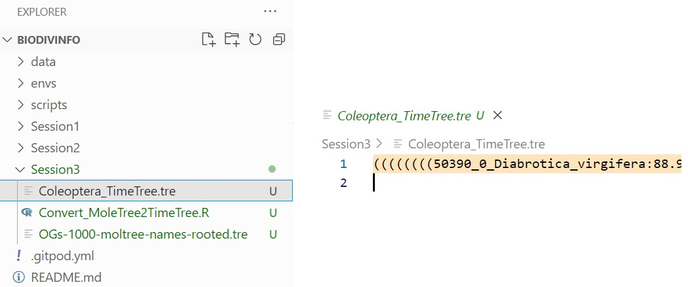
</figure>

The default view looks something like this, so we can use the `Advanced Control Panel` to change the views and thereby make comparisons with the literature tree easier.

<figure>
  
</figure>

{ style="float: right;", width=300 }  <!-- AT. Double-check path -->

Use the `Advanced Control Panel` to display the tree scale in inverted direction:

* `Internal tree scale`
    * `Display`
    * `Inverted scale`: `Yes`
* Use the "Fit to screen" button `[]` to resize your tree in the viewer

<br>Note how the Tree scale - measured in millions of years - goes all the way back to 256, which is the minimum root age we applied as a constraint when using chronos to build the time tree from the molecular tree.

<figure>
  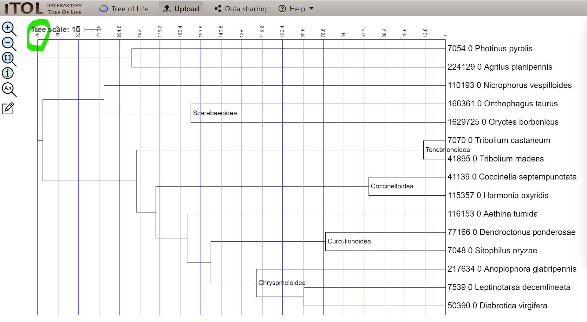
</figure>

!!! note "If you did not manage to visualise the tree"
    You can find it on Gitpod at `/workspace/biodivinfo/data/Session3/Step1/tree_time_calibrated.jpg`. Or you can directly see it [here](https://gitlab.com/evogenlab/teaching-repos/biodivinfo/-/blob/main/data/Session3/Step1/tree_time_calibrated.jpg).

**Question: What are the main differences between the ultrametric time-calibrated tree shown above and our input molecular phylogeny copied again here below for comparison?**

??? done "Answer"
    The branch lengths changed because the scale unit changed: this tree is expressed in time, while the previous one was expressed in substitutions/site. As a consequence, all the branches now have the same length, which is expected because all the species had the same span of time to evolve from their last common ancestor (_i.e._ the root of the tree).

<figure>
  
</figure>

**Questions:**

* **So what does 'ultrametric' mean in the context of phylogenetic trees?**
* **What might ultrametric trees be particularly useful for in terms of analyses?**

??? done "Answer"
    * An ultrametric tree is a rooted tree with edge lengths where all leaves are equidistant from the root. Here, it depicts times of divergence and as such can also be called a 'chronogram'
    * Ultrametric trees can be useful to relate evolution events (appearance of a species, for example) with other events (drastic and brutal changes in climate, adaptation to new life conditions...)

## Building a tree for a dynamic gene family

We will now follow the same steps that we did to compute a tree for a universal single-copy orthologous group in Session II, but this time selecting instead an orthologous group that has some species with more than one gene copy and some species missing an orthologue.

!!! note
    Remember that of the 14Let's753 Coleoptera-level orthologous groups, only 1Let's225 were showing single-copy orthologues in all 15 species. This means that the majority of orthologous groups show some level of dynamism in terms of gene gains and losses across this set of 15 beetle species.

Browsing OrthoDB I found an example orthologous group where some species have more than one copy and one species is lacking an orthologue: [https://www.orthodb.org/?level=7041&species=7041&query=10261at7041](https://www.orthodb.org/?level=7041&species=7041&query=10261at7041).

<figure>
  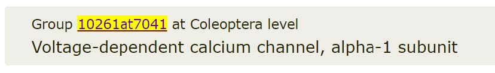
</figure>

It contains a total of 19 genes from 14 of the 15 Coleoptera species.

* 10 species = single-copy (_i.e._ no gene duplications)
* 4 species = multi-copy (_i.e._ gene duplications)

<figure>
  
</figure>

Collect the input sequences:
```
curl -o 10261at7041.fasta "https://data.orthodb.org/v11/fasta?id=10261at7041&species=7041"
```

Replace the colon "\_0:" in the protein identifiers with an underscore "\_0\_":
```
sed -i 's/_0:/_0_/g' 10261at7041.fasta
```

!!! note "If it did not work, fetch the fasta file from the data files folder"
    ```
    cp /workspace/biodivinfo/data/Session3/Step2/10261at7041.fasta .
    ```

Align the protein sequences - using MAFFT like before:
```
mafft --quiet --auto 10261at7041.fasta > 10261at7041.aln.fasta
```

Filter/trim the alignment using TrimAl like before:
```
trimal -in 10261at7041.aln.fasta -out 10261at7041.aln.trm.fasta -automated1 -htmlout 10261at7041.aln.trm.html
```

Build the gene tree using RAxML like before:
```
raxmlHPC-SSE3 -s 10261at7041.aln.trm.fasta -f a -N 10 -p 12345 -x 12345 -m PROTGAMMAJTT -n 10261at7041
```

<figure>
  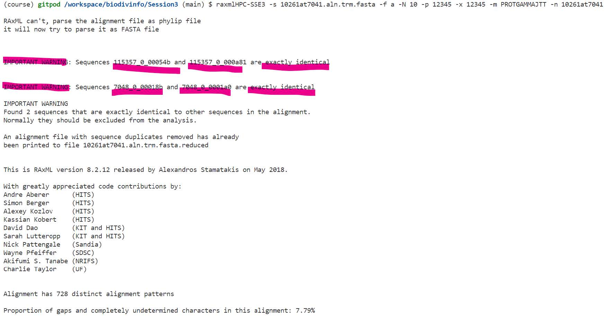
</figure>

!!! hint
    Note that RAxML is warning us that there are two pairs of sequences that are exactly identical and that these would normally be excluded from the analysis.

While RAxML is running you can download and view the trimmed alignment file (the HTML version) like we did before, to check out these identical sequences:

<figure>
  
</figure>

!!! note
    If you could not download it, you can view the alignment [here](https://glcdn.githack.com/evogenlab/teaching-repos/biodivinfo/raw/main/data/Session3/Step2/10261at7041.aln.trm.html).

<figure>
  
</figure>

* Sequences `115357_0_00054b` and `115357_0_000a81` are exactly identical (pink)
    * Two proteins from _Harmonia axyridis_
* Sequences `7048_0_00018b` and `7048_0_0001a0` are exactly identical (orange)
    * Two proteins from _Sitophilus oryzae_

!!! note
    These proteins are not exactly identical along their entire lengths, but they are identical along the regions selected by TrimAl to use for phylogeny reconstruction. RAxML takes just one of any set of identical proteins to use for the phylogeny reconstruction and then adds back to the final tree any exact duplicates.

**Question: Why might there be some identical or near-identical protein sequences in the genomes of some species, _i.e._ what does it suggest about the evolution of these genes?**

??? done "Answer"
    These genes probably underwent a duplication very recently. Only a short span of time passed since the duplication, which explains why they are onlly a few differences between the protein sequences.

!!! note "If these steps did not work you can fetch the results files from the data folder instead"
    ```
    cp /workspace/biodivinfo/data/Session3/Step2/10261at7041.aln.fasta .
    cp /workspace/biodivinfo/data/Session3/Step2/10261at7041.aln.trm.fasta .
    cp /workspace/biodivinfo/data/Session3/Step2/10261at7041.aln.trm.html .
    cp /workspace/biodivinfo/data/Session3/Step2/RAxML_info.10261at7041 .
    cp /workspace/biodivinfo/data/Session3/Step2/RAxML_bootstrap.10261at7041 .
    cp /workspace/biodivinfo/data/Session3/Step2/RAxML_bipartitions.10261at7041 .
    cp /workspace/biodivinfo/data/Session3/Step2/RAxML_bestTree.10261at7041 .
    ```

When RAxML is finished you should have a message on the terminal that looks something like the following:

<figure>
  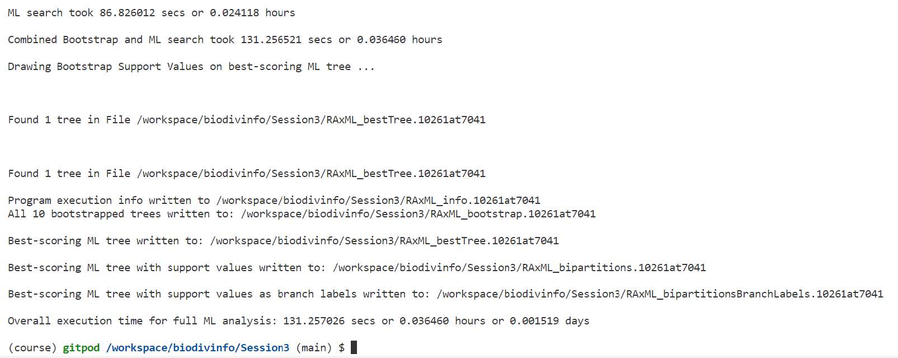
</figure>

Now we open and view the resulting gene tree with bootstrapping support values (`RAxML_bipartitions.10261at7041`) using [iTOL](https://itol.embl.de/) (as before).

!!! hint
    Note the two pairs of "identical" proteins that RAxML warned us about earlier:

    <figure>
      
    </figure>

To make this gene tree more visually comparable to the species tree, Let's start by properly rooting the tree according to where the known outgroup species (`7054_0` & `224129_0`) branch off from the rest of the species (circled in pink):

<figure>
  
</figure>

We can use iTOL to interactively reroot the gene tree knowing the outgroup species. Click on the branch circled in pink shown above, hover over Tree structure, and then select `Re-root the tree here`.

<figure>
  
</figure>

In the re-rooted tree the outgroup species (blue) are now clearly placed to define the root of this phylogeny:

<figure>
  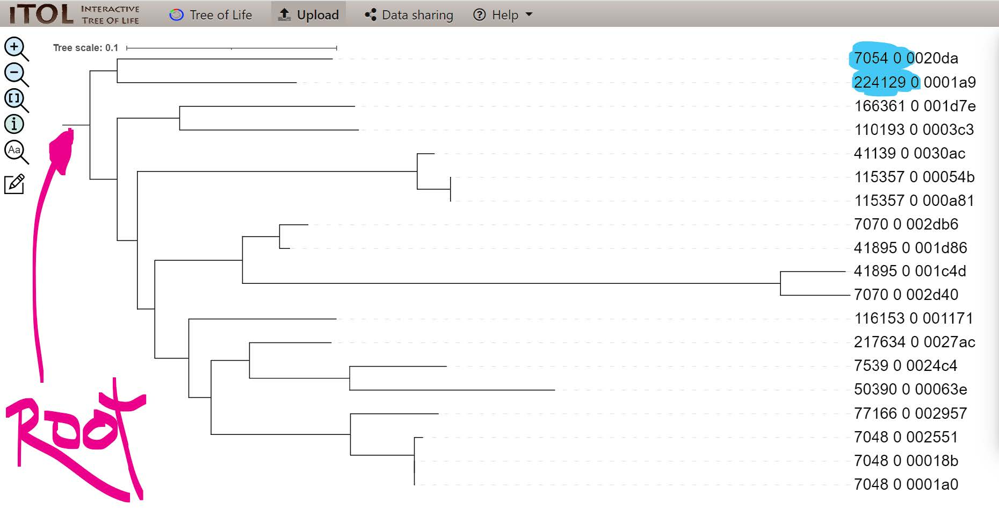
</figure>

!!! note "If you did not manage to visualise the tree"
    You can find it on Gitpod at `/workspace/biodivinfo/data/Session3/Step2/tree_dynamic_family_rerooted.jpg`. Or you can directly see it [here](https://gitlab.com/evogenlab/teaching-repos/biodivinfo/-/blob/main/data/Session3/Step2/tree_dynamic_family_rerooted.jpg).

**Question: Can you manually (just by eye) identify where all speciation nodes, duplication nodes, and loss events have occurred based on this gene tree?**

!!! hint
    When the identifiers start with the same numbers it means the genes are from the same species, _e.g._ species `7048_0` has three orthologues in this family.

??? done "Answer"
    As mentioned previously, there was 2 duplication events (3 genes) within species `7048_0`. 1 duplication (2 genes) event happened within species `115357_0`. 1 speciation and 1 duplication events (4 genes) happened within species `7070_0` and `41895_0`. However, it is very hard to guess where the loss event happened with just a gene tree. It would help to have more information about the species tree.

## Reconciling the gene and species trees

{ style="float: right;" width=250}  <!-- AT. Double-check path -->

Now we will try to see if an algorithm specifically designed to identify where all speciation nodes, duplication nodes, and loss events have occurred on a gene tree given a species tree agrees or disagrees with your manual assessments.

The main input requirements for `treerecs` are:

* A species phylogeny of all species: this can have more species than the gene tree but all species in the gene tree must be present in the species tree
    * We have the **ultrametric time-calibrated species tree** we made earlier: `Coleoptera_TimeTree.tre`
    * If you don't you can fetch it from the data folder:
    ```
    cp /workspace/biodivinfo/data/Session3/Step1/Coleoptera_TimeTree.tre .
    ```
* A gene tree: this can have fewer species than the species tree (due to losses) and it can have more than one gene per species (due to duplications)
    * We have the **molecular gene family tree** we made earlier: `RAxML_bipartitions.10261at7041`
    * If you don't you can fetch it from the data folder:
    ```
    cp /workspace/biodivinfo/data/Session3/Step2/RAxML_bipartitions.10261at7041 .
    ```
* A mapping file indicating which genes belong to which species: `treerecs` can try to do this by matching identifiers but it is advisable to provide a map
    * This we **made manually**, you can fetch it from the data folder:
    ```
    cp /workspace/biodivinfo/data/Session3/Step3/gene2species_map.txt .
    ```
    * This file simply lists the genes (green) and the species (blue) they belong to, so that `treerecs` knows which genes come from which species

    <figure>
      
    </figure>

Start by checking out what `treerecs` needs as command-line options, input, and output names etc. in order to perform a gene-tree-species-tree reconciliation: `treerecs -h`.

<figure>
  
</figure>

The main input that `treerecs` needs:

* `-g`, `--genetree GENETREE_FILE`
* `-s`, `--speciestree SPECIESTREE_FILE`
* `-S`, `--smap SMAP_FILE`
* We will also ask it to: `-r`, `--reroot`: find the best root according to the reconciliation cost
* We will ask it to produce both Newick and an image (.svg) output
* And we will ask it to: `-f`, `--force`: force possible overwrite of existing files

Putting them all together we have the following:
```
treerecs -g RAxML_bipartitions.10261at7041 -s Coleoptera_TimeTree.tre -S gene2species_map.txt -r -O newick:svg -f
```

<figure>
  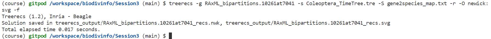
</figure>

This will create a folder called `treerecs_output`. The `.svg` output file can now be downloaded and viewed _e.g._ in a browser like Chrome. You can also click [here](https://gitlab.com/evogenlab/teaching-repos/biodivinfo/-/blob/main/data/Session3/Step3/treerecs_output/RAxML_bipartitions.10261at7041_recs.svg) to view it directly.

<figure>
  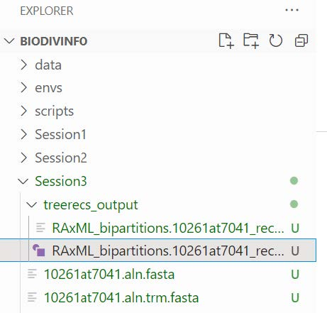
</figure>

!!! note "If treerecs failed you can fetch the files from the data folder"
    * The `.svg` file:
    ```
    cp /workspace/biodivinfo/data/Session3/Step3/treerecs_output/RAxML_bipartitions.10261at7041_recs.svg .
    ```
    * The Newick file:
    ```
    cp /workspace/biodivinfo/data/Session3/Step3/treerecs_output/RAxML_bipartitions.10261at7041_recs.nwk .
    ```

Viewing the Newick file you will see that there is a header printed that provides the total "cost" and the number of predicted duplications and losses:

<figure>
  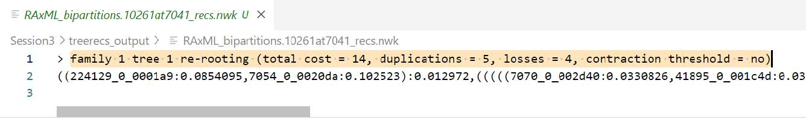
</figure>

**Question: What is meant by the "total cost" of the reconciliation?**

??? done "Answer"
    The total cost is the weighted sum of the cost of all the duplications and losses required to reconcile the two trees. Here, a duplication has a cost of 2 and a loss has a cost of 1 (5 * 2 + 4 * 1 = 14 = total cost).

The `.svg` image shows these results visually, by mapping the inferred evolutionary events (duplications  and losses ) inside the species phylogeny: showing a total of **5 predicted duplications** and **4 predicted losses**.

<figure>
  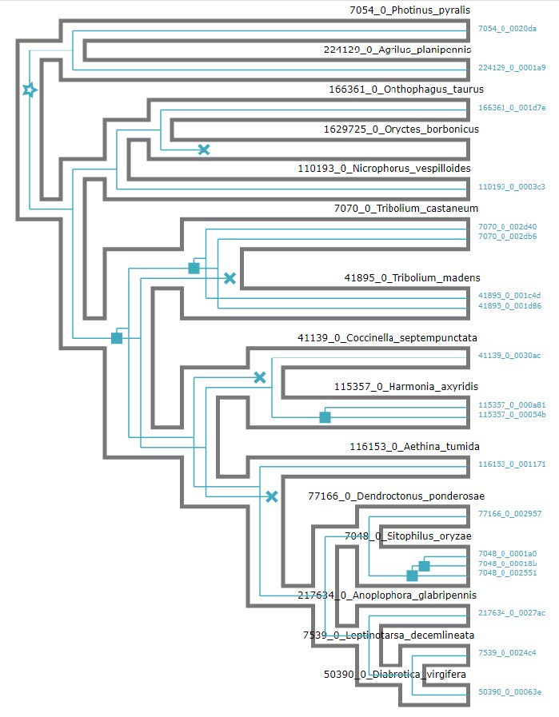
</figure>

!!! note "`treerecs` symbols"
    * Duplication:
    { style="float: middle;"}  <!-- AT. Double-check path -->
    * Loss:
    { style="float: middle;"}  <!-- AT. Double-check path -->

Let's now compare this with the input gene tree (`RAxML_bipartitions.10261at7041` - this should still be open in your iTOL browser), we can use iTOL to:

* `Basic`: invert the gene tree
* `Basic`: ignore the branch lengths
* `Advanced`: resize to be taller and narrower

<figure>
  
</figure>

!!! note "If you did not manage to visualise the tree"
    You can find it on Gitpod at `/workspace/biodivinfo/data/Session3/Step2/tree_dynamic_family_inverted.jpg`. Or you can directly see it [here](https://gitlab.com/evogenlab/teaching-repos/biodivinfo/-/blob/main/data/Session3/Step3/tree_dynamic_family_inverted.jpg).

**Question: Can you see the correspondence between the inferred events and the gene tree?**

??? done "Answer"
    The correspondence appears quite clearly. However, it is easier to visualise with both trees side-by-side (see below).

<figure>
  
</figure>

!!! note "High-resolution version"
    You can find a better version of the figure on Gitpod at `/workspace/biodivinfo/data/Session3/Step3/annotated_reconciliation.png`. Or you can directly see it [here](https://gitlab.com/evogenlab/teaching-repos/biodivinfo/-/blob/main/data/Session3/Step3/annotated_reconciliation.png).

The placement in the gene tree of the _Tenebrionoidea_ (_Tribolium castaneum_ & _Tribolium madens_) as more early branching than the _Coccinelloidea_ (_Coccinella septempunctata_ & _Hamonia axyridis_) is in conflict with the species tree. This means that reconciliation inferred **1 duplication** in the common ancestor of _Tenebrionoidea_-_Coccinelloidea_ (pink) followed by **3 losses** to match the counts in the gene tree (green).

<figure>
  
</figure>

**Question: Do you think this is a reasonable mapping of events - given that the node in the gene tree corresponding to _Tenebrionoidea_-_Coccinelloidea_ obtained only 50% support?**

??? done "Answer"
    This is probably not a reasonable mapping of event. Uncertainty in the gene tree is causing the reconciliation to over-complicate the number of events needed to resolve the two trees.

The good news is that `treerecs` can be asked to ignore weekly-supported nodes of a gene tree during the reconciliation process, setting a threshold _e.g._ of 55%:

* Achieved by adding the `-t 55` option
* We also give the output a name `-o treerecs_output2` so it does not overwrite our first attempt at reconciliation using default parameters
```
treerecs -g RAxML_bipartitions.10261at7041 -s Coleoptera_TimeTree.tre -S gene2species_map.txt -r -O newick:svg -f -t 55 -o treerecs_output2
```

!!! note "If treerecs failed you can fetch the files from the data folder"
    * The `.svg` file:
    ```
    cp /workspace/biodivinfo/data/Session3/Step3/treerecs_output2/RAxML_bipartitions.10261at7041_recs.svg .
    ```
    * The Newick file:
    ```
    cp /workspace/biodivinfo/data/Session3/Step3/treerecs_output2/RAxML_bipartitions.10261at7041_recs.nwk .
    ```
    When you download this new `.svg` make sure to change the name or it could overwrite the one you downloaded previously

    <figure>
      
    </figure>

The result maps the inferred evolutionary events (duplications and losses) inside the species phylogeny: now **4 duplications** and **1 loss**

* 3 duplications appear as recent species-specific gene duplications
* 1 duplication appears in the ancestor of _Tribolium castaneum_ & _Tribolium madens_

<figure>
  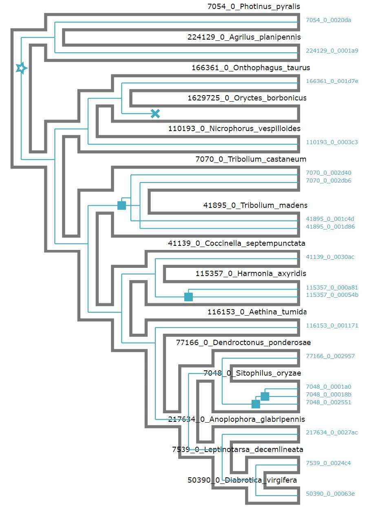
</figure>

**Questions:**

* **Do you think this is a more reasonable mapping of events?**
* **Why is the _Tribolium_ duplication considered as an ancestral event and not two independent duplications, one in each species of _Tribolium_?**

??? done "Answer"
    * This mapping of events is more reasonable because it decreases the number of events required to explain the phylogeny. As such, it respects the [principle of maximum parsimony](https://en.wikipedia.org/wiki/Maximum_parsimony_(phylogenetics))
    * For the same reason than previously: it is more likely to see 1 ancestral duplication event followed by 1 speciation event rather than 1 speciation event followed by 2 ancestral duplication events

<figure>
  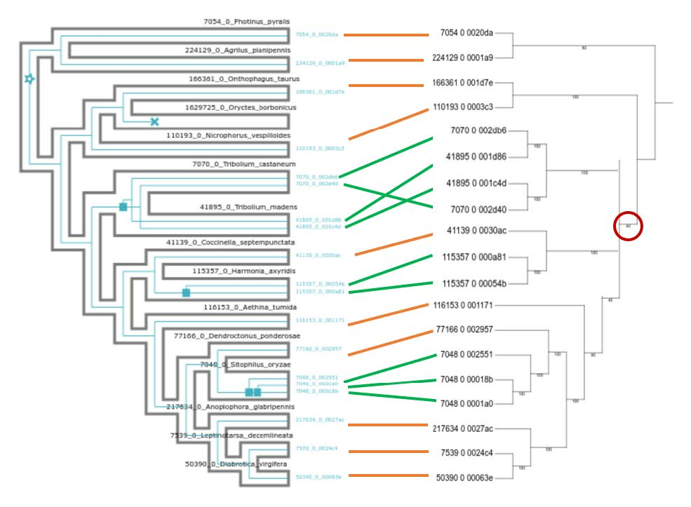
</figure>

!!! note "High-resolution version"
    You can find a better version of the figure on Gitpod at `/workspace/biodivinfo/data/Session3/Step3/annotated_reconciliation2.png`. Or you can directly see it [here](https://gitlab.com/evogenlab/teaching-repos/biodivinfo/-/blob/main/data/Session3/Step3/annotated_reconciliation2.png).
