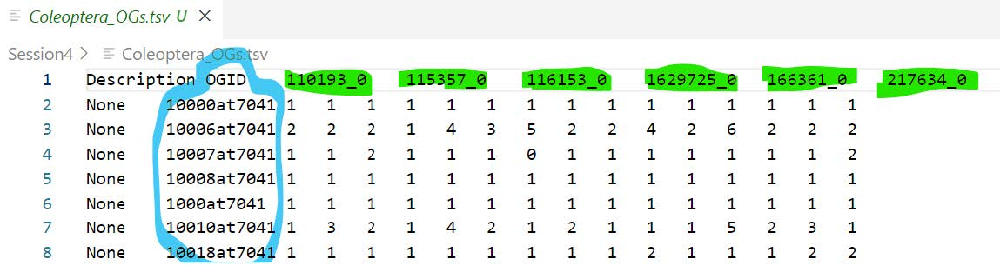
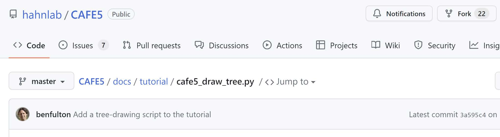
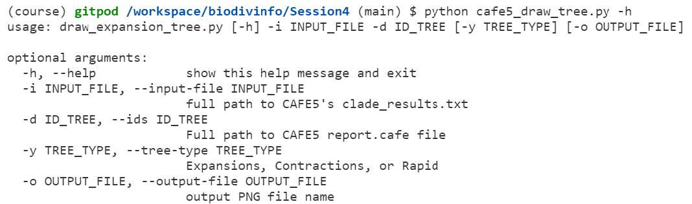
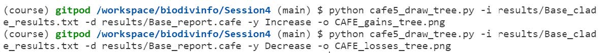
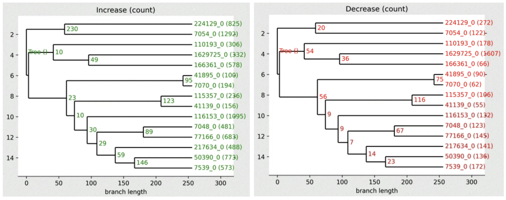
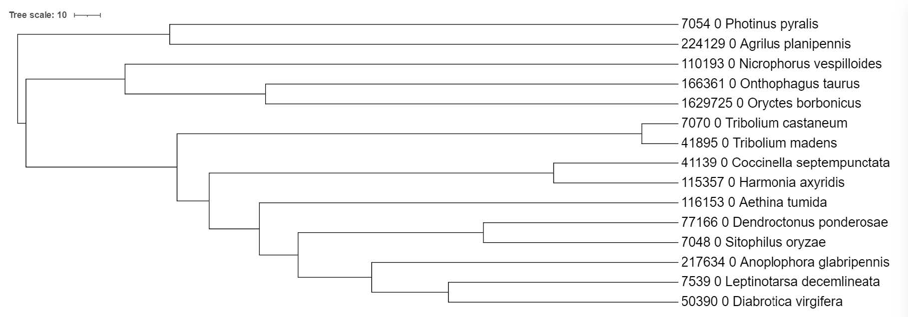
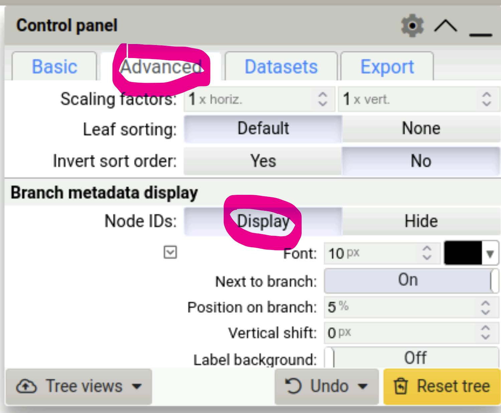
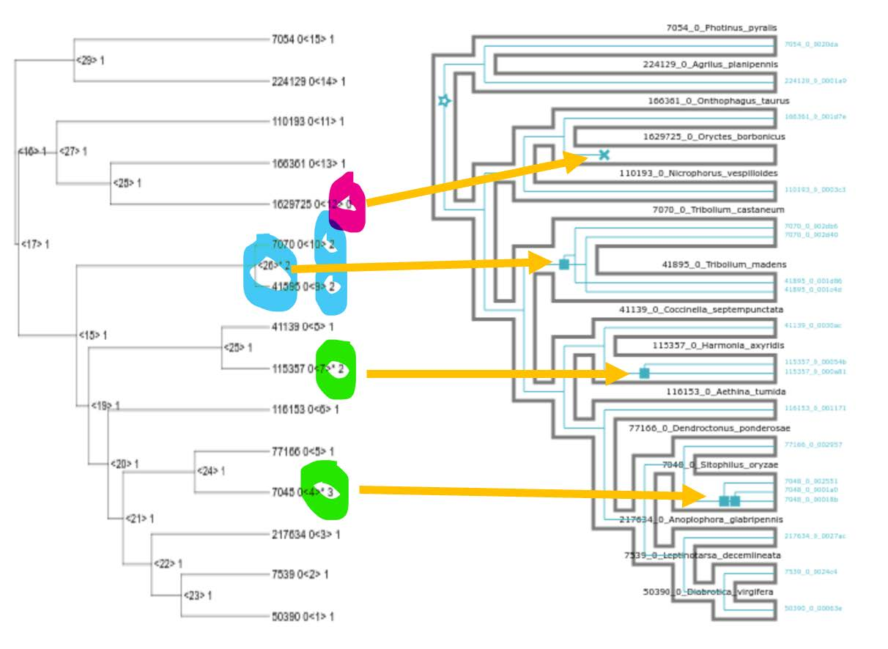
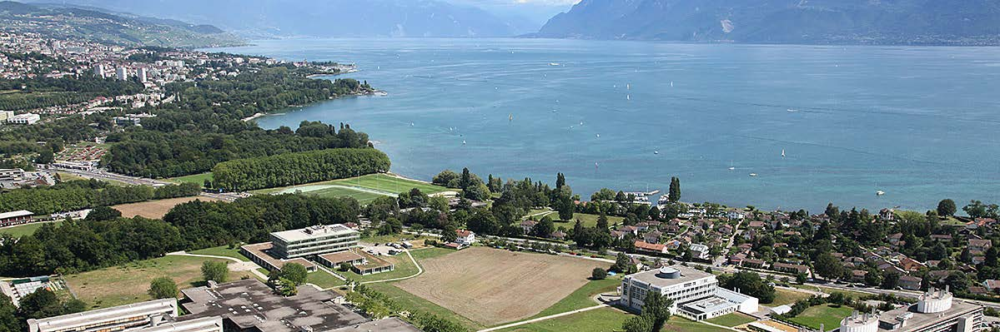

## Aim

Estimate ancestral gene copy numbers given the species phylogeny and counts of orthologous genes present in extant species.

## Learning outcomes

* What is the difference between tree reconciliation and state reconstruction?
* What is gene family ancestral state reconstruction trying to achieve and how?

## Using orthologue counts to estimate ancestral gene content

{ style="float: right;" width=250}  <!-- AT. Double-check path -->

There are a huge range of tools designed for ancestral state reconstructions, you may for example have encountered the R package, [phytools](http://www.phytools.org/). Today we will use [CAFE5](https://github.com/hahnlab/CAFE5), a tool specifically designed for working with gene count data to infer ancestral gene contents per gene family.

Before we reconstruct the ancestral state gene content of our species of interest, let's create a working directory for this exercise, starting by opening a terminal on the Workspace if you've not already got one open. Then, from the `/workspace/biodivinfo/` directory, create a new directory (`mkdir`) and navigate into the new directory (`cd`):

```
cd /workspace/biodivinfo/
mkdir Session4
cd Session4/
```

We will continue to work with the same dataset of orthologous groups delineated across 15 beetles from OrthoDB. The main input requirements for CAFE are:

* An ultrametric time-calibrated species tree
	* We have the **ultrametric time-calibrated species tree** we made earlier: `Coleoptera_TimeTree_IDs.tre`
	* This is a version with just the species identifiers not the names. You can fetch it from the data folder:
	```
	cp /workspace/biodivinfo/data/Session4/Coleoptera_TimeTree_IDs.tre .
	```
* A table of counts of orthologues per species
	* This table was obtained by downloading and parsing the full table of orthology data from OrthoDB to extract counts of genes per species for _Coleoptera_-level orthogroups, you can fetch these pre-processed data here:
	```
	cp /workspace/biodivinfo/data/Session4/Coleoptera_OGs.tsv .
	```
	* The table contains rows of orthogroups (blue) with columns of species (green) and all the counts of orthologues per orthogroup per species
		* For the class the full set of **14'753** orthogroups has been first filtered to select only orthologous groups found in more than 90% of species (with no restriction on gene copy-number), leaving **6'824** orthogroups. Note that the **species names/identifiers** must be the same as those we have in our **ultrametric time-calibrated species phylogeny**

		<figure>
		  
		</figure>

Start by checking out what `CAFE` needs as command-line options, input, and output names etc. in order to perform an ancestral state reconstruction:

```
cafe5 -h
```

<figure>
  
</figure>

The main input that CAFE needs:

* `-i`, `--infile`: path to tab delimited gene families file to be analysed
* `-t`, `--tree`: path to file containing Newick formatted tree

Putting this all together we have the following:
```
cafe5 -i Coleoptera_OGs.tsv -t Coleoptera_TimeTree_IDs.tre
```

<figure>
  
</figure>

CAFE uses a **birth and death process** to model gene gain and loss across a user-specified phylogenetic tree. The distribution of family sizes generated under this model provides a basis for assessing the **significance of the observed family size differences** among taxa. Estimating Lambda (the traditional running of CAFE) performs a maximum likelihood calculation to estimate the most likely rate of change across the entire tree, given all the families and their counts

For a typical CAFE analysis, users are most interested in determining two things:

* Which gene families/orthogroups are rapidly evolving?
* On which branches of the tree these families are rapidly evolving?

By default, CAFE creates its outputs into a folder called "results":
```
ls -l /workspace/biodivinfo/Session4/results
```

<figure>
  
</figure>

!!! note "If CAFE failed, you can get the file from the folder with data files for the practical instead"
    ```
    cp -r /workspace/biodivinfo/data/Session4/results .
    ```

The `Base_asr.tre` output file contains all orthogroups with the ancestral gene counts mapped to the species tree. You might recognise the first tree as the orthogroup we used to build our first species tree (`10000at7041)`.

<figure>
  
</figure>

We can get an overview of gains and losses across all families using a script provided by CAFE, `cafe5_draw_tree.py`:
```
wget https://raw.githubusercontent.com/hahnlab/CAFE5/master/docs/tutorial/cafe5_draw_tree.py
```

!!! note "You can also fetch the python script from the folder with data files for the practical"
    ```
    cp /workspace/biodivinfo/scripts/cafe5_draw_tree.py .
    ```

<figure>
  
</figure>

Start by checking out what are the script parameters:
```
python cafe5_draw_tree.py -h
```

<figure>
  
</figure>

First we can plot the gains (Increase) across the tree:
```
python cafe5_draw_tree.py -i results/Base_clade_results.txt -d results/Base_report.cafe -y Increase -o CAFE_gains_tree.png
```

And now we can plot the losses (Decrease) across the tree:
```
python cafe5_draw_tree.py -i results/Base_clade_results.txt -d results/Base_report.cafe -y Decrease -o CAFE_losses_tree.png
```

<figure>
  
</figure>

The `.png` output files should be in your working directory, you can open them in Gitpod to view numbers of families showing gains or losses across the species tree.

<figure>
  
</figure>

!!! note "High-resolution version"
    You can find a better version of the figure on Gitpod at `/workspace/biodivinfo/data/Session4/CAFE_gains_tree.png` and `/workspace/biodivinfo/data/Session4/CAFE_losses_tree.png`. Or you can also see them here: [gains](https://gitlab.com/evogenlab/teaching-repos/biodivinfo/-/blob/main/data/Session4/CAFE_gains_tree.png) & [losses](https://gitlab.com/evogenlab/teaching-repos/biodivinfo/-/blob/main/data/Session4/CAFE_losses_tree.png)

**Questions:**

* **Which internal node shows the most gains?**
* **Which internal node shows the most losses?**

??? done "Answer"
    * The node between species `224129` and `7054` shows the most gains (230).
    * The node between species `115357` and `7070` shows the most losses (116).

A reminder of the species in our tree:

<figure>
  
</figure>

## Comparing ancestral gene content estimates with reconciliation results

As a final step we can compare the results from our previous gene-tree-species-tree reconciliation of orthogroup `10261at7041` with those from gene family ancestral state reconstruction.

Extract the gain-loss annotated tree for `10261at7041` from the CAFE results:
```
grep 10261at7041 results/Base_asr.tre
```

<figure>
  
</figure>

Copy the output of the previous `grep` command (which is a Newick tree) and open it in iTOL as we did before - note that the Newick tree starts with the first open parenthesis and ends with the semicolon. Use the `Advanced Control Panel` to Display the Node IDs and view internal node annotations.

!!! note
	You can also find the Newick file on gitpod at: `/workspace/biodivinfo/data/Session4/10261at7041_reconstruction.nwk`

<figure>
  
</figure>

!!! note "If you did not manage to visualise the tree"
    You can find it on Gitpod at `/workspace/biodivinfo/data/Session4/tree_10261at7041_CAFE.jpg`. Or you can directly see it [here](https://gitlab.com/evogenlab/teaching-repos/biodivinfo/-/blob/main/data/Session4/tree_10261at7041_CAFE.jpg).

{ style="float: right;" width=300}  <!-- AT. Double-check path -->

Terminal nodes (leaves) are labelled with the species (green), CAFE's own numbering of all nodes in the tree (yellow) and finally gene the copy number (pink). Nodes inside the tree are labelled with the internal CAFE numbering of all nodes in the tree (yellow) and the gene the copy number (pink).

Nodes exhibiting significant changes from their ancestral states are indicated with an asterisk (\*). We can now place our CAFE estimates next to our treerecs estimates to compare the results from the two approaches:

<figure>
  
</figure>

**Question: Do the ancestral state reconstructions results (`CAFE`) agree with the tree reconciliation events (`treerecs` - after asking it to ignore low-confidence nodes)?**

??? done "Answer"
    Yes, they perfectly agree with each other!

<br>

# Congratulations, you made it to the end!

<figure>
  
</figure>
