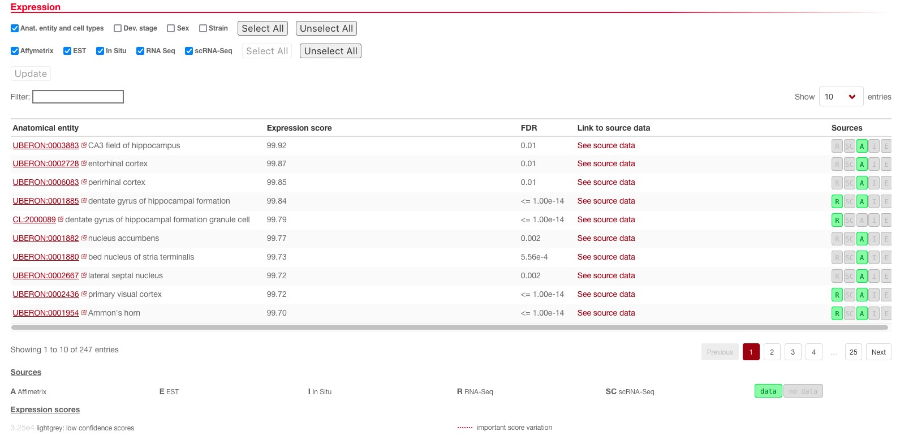
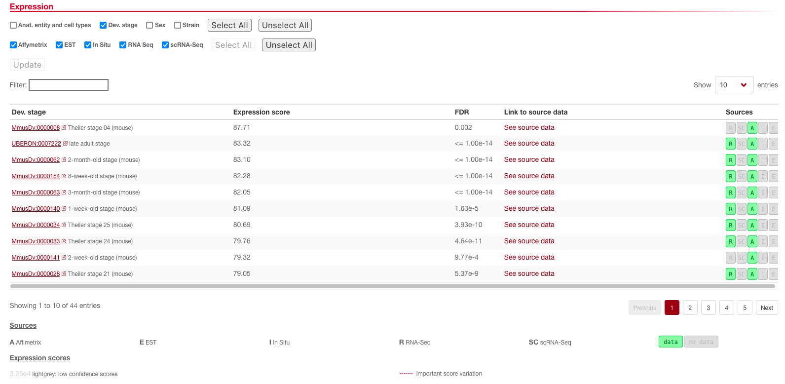
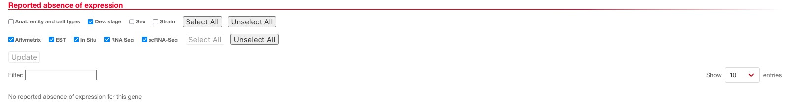

## Aim

Use the gene `NCDN` as a case example and investigate how to know about a gene's function.

## Learning outcomes

* What can we learn about `NCDN` function determination in Uniprot?
* What does `NCDN` Gene Onthology (GO) annotation tells us about its function?
* What can we deduce from `NCDN` gene expression in several species?

## Introduction

We will start the hands-on part of this course by focusing on a single gene as a case study. In this case, we will use the gene `NCDN` (neurochondrin).

## Check about `NCDN` in Uniprot

Go to [Uniprot](https://www.uniprot.org/) and find the **human** gene `NCDN` page (`NCDN_HUMAN`). There is a lot of information within a Uniprot's protein page; let's first focus on the function description.

!!! hint
    Leave all the different species gene pages open in tabs. We will come back to them!

**Questions:**

* **What can we learn from the description of the human `NCDN`'s function?**
* **How was this information annotated?**

??? done "Answer"
    * It is involved in signal transduction in the nervous system
    * The information was manually curated and obtained from two different papers (the information of both can be found next to the information that was retrieved from them)

Now go to the **mouse** gene `NCDN` Uniprot page (`NCDN_MOUSE`).

**Questions:**

* **What can we learn from the description of the mouse `NCDN`'s function?**
* **How was this information annotated?**

??? done "Answer"
    Similar information, three different papers linked to it.

Try it again with the **bovin** gene (`NCDN_BOVIN`), the **drosophila** gene page (`NCDN_DROME`) and the **xenopus** gene page (`NCDN_XENLA`).

??? done "Answer"
    * Bovin information was obtained by sequence similarity to other species protein
    * There is not a lot of information in the _Drosophila_ page and it was obtained from a mutant (no link to any paper in this case)
    * _Xenopus_ information was also obtained by sequence similarity to other species

**Questions:**

* **What can we learn about Uniprot's gene function assessment?**
* **In which species is most of the research on `NCDN` done?**

??? done "Answer"
    * For the model species in which studies are preformed, normally, there is high quality, manually curated information with easy link to the publication sources. For non-model species for which no specific research was performed, all the information that we can find is deduced by sequence similarity to model species
    * Mouse but mostly rat

Two other ways to shed light into a gene's function are checking its subcellular localization and its sequence features (domains, variants…). We can find information on both of these aspects in Uniprot. First, focus on the subcellular location. There is one section dedicated to this in all Uniprot gene pages. Explore all the ones we opened before.

**Questions:**

* **Is `NCDN` subcellular location informative on its function?**
* **From where was each information retrieved?**

??? done "Answer"
    * It can be found in the dendrites and the postsynaptic space. It makes totally sense with its function. Now we know that it has a role in the postsynaptic part of signal transduction
    * For all species, the information is mainly obtained by similarity to the rat uniprot page because most of the research in this regard was done in rat

Now try the same with the sequence features. There is a new `Feature viewer` in Uniprot gene pages. Explore it for all the species above.

**Questions:**

* **Is the `NCDN` sequence informative?**
* **Does it mean that retrieving information from a protein sequence is meaningless?**

??? done "Answer"
    * It is not very informative but still we can learn about variants of its sequence, post translational modifications, protein structure, etc...
    * No, in many cases it can be informative and in any case, knowing about these features can complement other information and help understand the protein function

## Learn about `NCDN`'s Gene Ontology annotation

Now, we will focus on `NCDN`'s Gene Ontology (GO) annotation. There are many tools that use GO annotation in different ways. In this practical, we will use some of the most established ones.

First, still in the Uniprot gene pages. Go to the GO annotation section on each page. Compare the GO terms in which `NCDN` is annotated in each species and the sources of such annotations.

**Question: What can we learn on GO annotations in non-model species?**

??? done "Answer"
    GO Annotations in non-model species are again, retrieved by similarity from model species.

Go to the [AmiGO 2 website](https://amigo.geneontology.org/amigo/landing), in the top menu, select `Search` and then `Genes and gene products`. Search for our `NCDN` gene.

**Questions:**

* **For which species do we have information? Why?**
* **How can we get GO annotations for other species?**

??? done "Answer"
    * Mainly mammals including the model species and the non-mammal model species. This means that we have information for the species that are more frequently studied
    * As we saw before, with the lack of specific studies, GO annotation for other species can be retrieved by sequence similarity between homologous proteins. This is helpful in many cases because it provides information without investing time and money to do the studies for each species. At the same time, this information needs to be handled with caution because it is only deduced by similarity, it has not been demonstrated for each given species

Now you can go to each species AmiGO 2 `NCDN` pages. Explore them a bit.

**Question: From where do they retrieve the evidence for the GO annotations?**

??? done "Answer"
    Many of the annotations are already phylogenetic-based propagations. Basically, only the model species have originally attributed GO annotations

## Look at expression of `NCDN` for several species in Bgee

We are now going to utilize the Bgee database in order to retrieve expression related information on our target gene (`NCDN`). You can access the webpage of Bgee in your browser by following [this link](https://www.bgee.org/).

You will arrive at the Bgee homepage where you can access the various tools of Bgee in the top toolbar, directly search for a gene in the middle search box or download expression data for various animal species by clicking on the correct species picture in the bottom of the page. For this step, we will be interested in continuing to explore the function of `NCDN` orthologs, now focusing on their expression. To do this, you will just need to search for a gene name (`NCDN`), a UniProt or an Ensembl identifier.

<figure>
  
</figure>

Doing this, you will be directed to the gene search result page where you can see that there are 49 genes in Bgee for the gene name `NCDN`.

**Question: Why are there multiple Ensembl identifiers for one gene name (`NCDN`)?**

??? done "Answer"
    We can see that the gene names do not change (always `NCDN`), however there are multiple Ensembl identifiers because each one corresponds to the `NCDN` of a different species. Indeed, each Ensembl ID has prefixes identifying the species and feature type.

In this page, you will notably find a column for `Gene identifier` that represents the unique Ensembl identifiers for each species or the species scientific and common name in the column `Organism`. To continue, please select a species (for example **mouse**) and click on their Ensembl ID ([ENSMUSG00000028833](https://www.bgee.org/gene/ENSMUSG00000028833/)). This will lead you to the mouse specific gene page for `NCDN`; don't worry you will still be able to see other orthologs of `NCDN`.

<figure>
  
</figure>

On the left, you have the headers that allow you to jump easily to different sections of the page such as Expression or Orthologs. Since in this exercise we want to know where `NCDN` is expressed, we will primarily focus on the expression section for now.

<figure>
  
</figure>

In this expression tab, you will find all anatomical entities where Bgee has evidence that this gene is expressed. You will notably find the expression score that denotes how strongly the gene was expressed in that tissue (from 0 to 100). If you want to verify the given information, you can also access the data used to determine expression in the link to source data column or see which type of data was used in source (such as R for bulk RNA-seq or A for Affymetrix microarray).

**Question: Looking at the top entries in the expression table, in which organ(s) do you think this gene is generally expressed?**

??? done "Answer"
    We can see that the top three hits are _CA3 field of hippocampus_, _CA3 field of hippocampus_, _perirhinal cortex_. If we look at the next 10 hits, we also see that they are all tissues belonging to the brain. We can therefore suggest that this gene is expressed throughout the brain at really high levels (in the top 1% of most highly expressed genes in this region).

We can also investigate if this gene is expressed at different stages of development. To do so, you can unselect `Anat. entity and cell types` and tick the `Dev. stage` box on top of the expression tab and update the results.

<figure>
  
</figure>

Here, we see that this gene seems to be expressed in late adults as well as the embryonic stage (for example, `Theiler stage 04`). If you are unsure what a developmental stage term means, clicking on the identifier (_e.g._ `MmusDv:0000008`) will take you to the description of this term in the developmental ontology. Interestingly, in this case, looking at the `Reported absence of expression` section (below in the same page), we can see that there are no developmental stages where the gene is not expressed at all, even though its expression is much lower outside the brain.

<figure>
  
</figure>

**Questions:**

* **Go back to the `Expression` section and the `Anat. entity and cell types` filter. Where is `NCDN` the least expressed?**
* **Play around by combining the filters for sex, strain, developmental stage or anatomical entities, which insights can you gather?**

??? done "Answer"
    * We can see, for example, that `NCDN` has relatively low expression in renal tissue even though it is still expressed (expression score lower than 50)
    * We can, for example, see that mouse strains C57BL/6 X CD-1 have a way lower expression overall of the `NCDN` gene than C57BL/6-Tyr c-Brd strains. We can also see that this gene is expressed throughout the life cycle of mice from embryonic stages to adulthood

By clicking on the `Orthologs` section in the menu on the left or scrolling down to it, you can find the different orthologs for NCDN which are found in Bgee. This information is retrieved from the OMA SPARQL endpoint that you used on the first day. Orthologs for NCDN are found at 11 different taxon levels. You can see the Ensembl identifiers of orthologous genes at specific taxon levels by clicking the `See details` arrow.

<figure>
  
</figure>

**Question: Which is the higher taxon in which you can find human orthologs of mouse `NCDN`?**

??? done "Answer"
    The _Euarchontoglires_ taxon.

Unfold the orthologs (`See details`) to find the human `NCDN`, and open its page in a new tab.

**Question: Does the function of `NCDN` seem to have been conserved between mouse and human? What about more distant species?**

??? done "Answer"
    Looking at the `NCDN` gene in humans by finding it through the orthologs section, we can see that the `NCDN` gene is also highly expressed in the same tissues and at really similar levels of expression. We could therefore hypothesize that its function remained similar.

Now we are going to compare the expression of the different orthologs of `NCDN` for Xenopus, Human, mouse, rat, guinea pig and macaque.

First, gather the Ensembl identifiers for those genes by looking at the orthologs tab!

* Rat (`ENSRNOG00000011751`)
* Xenopus (`ENSXETG00000009669`)
* Human (`ENSG00000020129`)
* Mouse (`ENSMUSG00000028833`)
* Guinea pig (`ENSCPOG00000023962`)
* Macaque (`ENSMMUG00000019812`).

We will learn to use Bgee expression comparison tool in order to gain novel insights on `NCDN` anatomical expression. To do this, click on the Analysis section of the top toolbar of Bgee and then on Expression comparison.

<figure>
  
</figure>

Fill the orthologs identifiers in the gene list, with one gene per line and click the search button to launch Bgee's expression comparison tool.

<figure>
  
</figure>

You will obtain the following results:

<figure>
  
</figure>

**Question: Looking at the max expression scores, do the results seem consistent with the anatomical localization of `NCDN` expression when looking at individual species?**

??? done "Answer"
    Yes, the results are highly consistent, again we can see that `NCDN` expression is extremely highly expressed in the same tissues (mainly brain) throughout the given species.

The conservation score represents the ratio between genes being called present in the tissue and the total number of genes. In our case since we only used orthologs, this value gives us the ratio between species which have `NCDN` expressed in that tissue divided by the total number of species for which we have data in that condition (maximum 6).

**Question: With the help of the conservation score, can you see for which species and tissue there is a qualitative difference in the expression of `NCDN`?**

??? done "Answer"
    Yes, we can see that _Xenopus tropicalis_ has lost expression of this gene in spleen and small intestine wherehas its expression remains relatively high in the other species.
